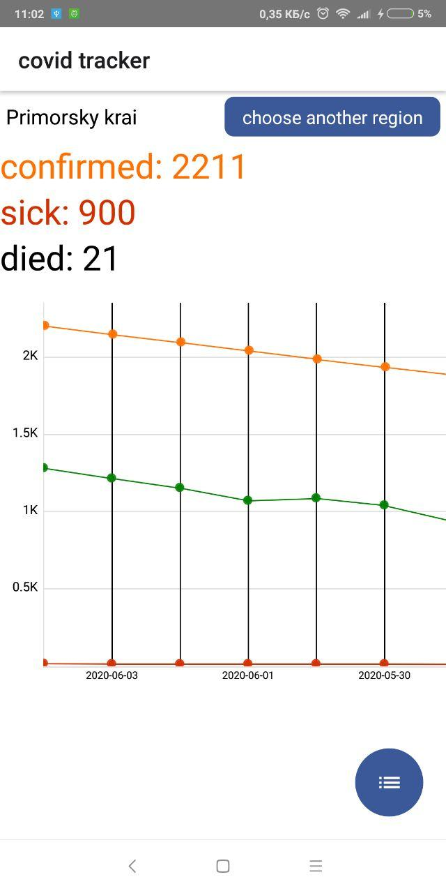
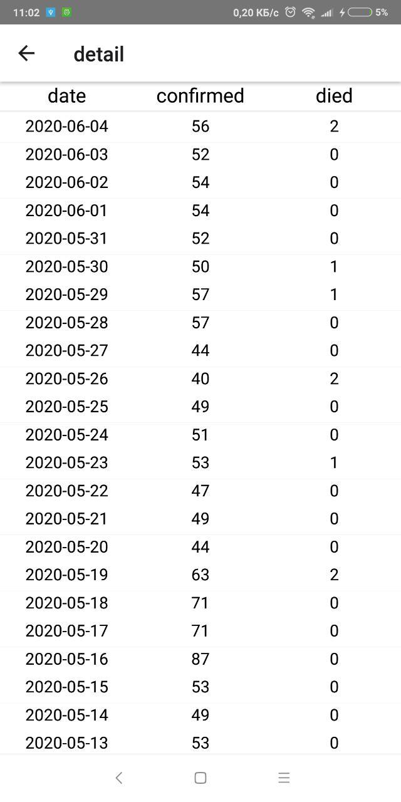
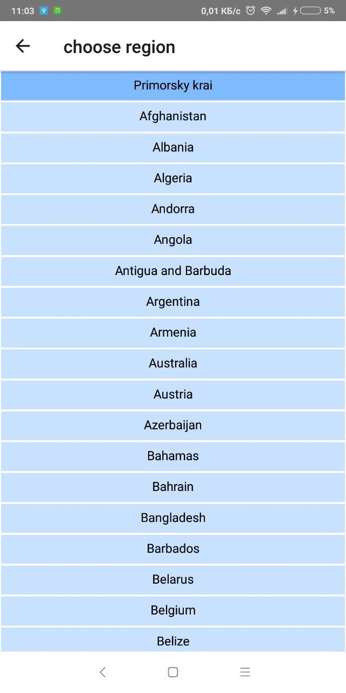

# Covid tracker based on react-native

A mobile application built using React Native.

Home screen | Detail screen | List screen
-- | -- | --
 |  | 

## Requirements

* `react-native-pure-chart`
* `react-papaparse`
* `react-native-community/async-storage`

## Get data from

* https://www.newsvl.ru/covid19/
* [COVID-19 Data Repository by the Center for CSSE at Johns Hopkins University](https://github.com/CSSEGISandData/COVID-19)

## Setup instructions

```
git clone https://github.com/AnnaProkopas/react-native-covid-tracker
cd react-native-covid-tracker
npm install
npm start
```